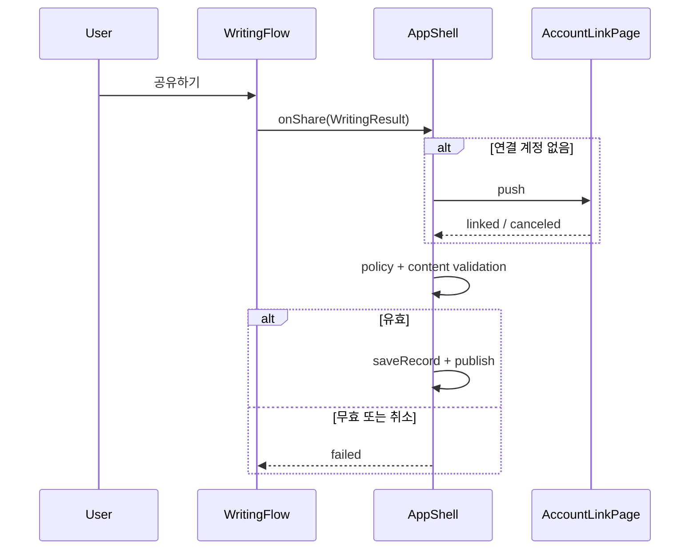

# Plan — ETC-726: 익명 공유 계정 연결 화면 선행

## 아주 쉬운 설명

- 현재는 기록 내용 검사가 계정 로그인보다 먼저 실행되어, 빈 기록 상태에서 `공유하기`를 누르면 로그인 화면 대신 모호한 오류가 뜬다.
- 앱의 실제 공유 경로에서는 먼저 계정을 연결하게 하고, 연결이 끝난 뒤 게시할 글을 검사한다.
- 서버의 게시 권한과 콘텐츠 안전 검사는 그대로 유지한다.

## 핵심 요약

- **무엇**: 익명 사용자의 `공유하기`가 `AccountLinkPage`를 먼저 열도록 공유 흐름의 검증 순서를 바꾼다.
- **왜**: `WritingFlow._share()`의 사전 메타데이터 검증이 `AppShell._persistWritingResult()` 호출 자체를 막아 로그인 분기에 도달하지 못한다.
- **접근**: AppShell callback 사용 시 콘텐츠 검증을 callback으로 이관하고, callback에서 계정 연결 → 정책 동의 → 콘텐츠 검증 → 저장 순서를 적용한다. callback 없는 독립 WritingFlow는 기존 검증을 유지한다.

## PLAN 무게

PLAN 무게: 경량 — 단일 Flutter 화면의 가역적인 제어 흐름 수정이며 데이터 모델·서버 계약 변경이 없다.

## 요구사항 요약

- [x] 익명 상태에서 `공유하기`를 누르면 입력 유효성보다 먼저 계정 연결 화면이 열린다.
- [x] 계정 연결 취소 시 작성 화면과 입력은 유지된다.
- [x] 계정 연결 후 유효하지 않은 콘텐츠는 기존 안전 메시지로 차단된다.
- [x] 연결 계정의 유효한 콘텐츠는 기존 저장·게시 경로를 그대로 사용한다.
- [x] callback 없는 독립 `WritingFlow`의 2,000자 제한 등 기존 검증은 유지된다.

## Non-goals

- Firebase Auth 계정, custom claim, Functions 게시 권한 정책은 변경하지 않는다.
- 화면 스타일·문구·내비게이션 구조를 재설계하지 않는다.

## 수정할 파일

| 파일 | 변경 내용 |
|------|-----------|
| `lib/main.dart` | 새 글·저장 기록 공유 경로를 계정 연결 → 정책 → 콘텐츠 검증 → 저장 순서로 변경하고, 이메일 dialog가 자체 controller 수명을 소유하게 한다. |
| `test/app_store_review_flow_test.dart` | 빈 입력이어도 AppShell callback까지 도달해 계정 연결 게이트를 실행할 수 있음을 회귀 테스트로 고정한다. |
| `test/account_link_email_test.dart` | 이메일 입력 후 취소 시 controller 조기 dispose assertion 없이 계정 연결 화면으로 복귀하는지 검증한다. |
| `docs/APP_STORE_REVIEW.md` | 심사 재현 원인과 수정 후 계정 연결 접근 절차를 현재형으로 갱신한다. |

## 구현 설계 — 어떻게 바꾸나

### 핵심 변경 코드

```dart
// lib/main.dart — WritingFlow._share
Future<void> _share(StoryItem story) async {
  if (sharing) return;
  final callback = widget.onShare;
  if (callback == null) {
    final violation = findCommunityContentViolation(/* 현재 입력 */);
    if (violation != null) {
      showViolation(violation);
      return;
    }
  }

  setState(() => sharing = true);
  final result = _writingResult(story, shared: true);
  // callback이 있으면 AppShell이 auth + validation + persistence를 소유한다.
  final outcome = await callback!(result);
  // 기존 succeeded/failed/indeterminate 처리 유지
}
```

```dart
// lib/main.dart — _AppShellState._persistWritingResult
if (result.shared) {
  final provider = await AppFirebaseService.instance.linkedProvider();
  if (provider == null) {
    final linked = await Navigator.push<bool>(context, AccountLinkPage(...));
    if (linked != true) return WritingShareOutcome.failed;
    await _syncSafetyAfterAccountChange();
  }
  if (!await ensureCommunityPolicy(context) || !mounted) {
    return WritingShareOutcome.failed;
  }
  final violation = findCommunityContentViolation(/* result fields */);
  if (violation != null) {
    _showMessage(violation.message);
    return WritingShareOutcome.failed;
  }
}
// 기존 currentUserId 확인, saveRecord, outcome reconciliation을 계속 수행한다.
```

`_shareSavedRecord`도 같은 순서로 바꿔 저장 기록 공유에서 동일한 선행 검증 차단이 재발하지 않게 한다.

```dart
// lib/main.dart — dialog가 controller lifetime을 소유한다.
class _EmailSignInDialog extends StatefulWidget {
  const _EmailSignInDialog();
}

class _EmailSignInDialogState extends State<_EmailSignInDialog> {
  final emailController = TextEditingController();
  final passwordController = TextEditingController();

  @override
  void dispose() {
    emailController.dispose();
    passwordController.dispose();
    super.dispose();
  }

  // 취소는 null, 로그인은 정리된 (email, password)를 반환한다.
}
```

### 입출력 계약

- `WritingFlow._share`
  - callback 있음: 모든 현재 입력을 `WritingResult`로 전달한다. 콘텐츠 유효성 때문에 callback 호출을 생략하지 않는다.
  - callback 없음: 기존 client-side 안전 검증, policy, 계정 연결, route 반환 순서를 유지한다.
  - 실패·취소: route와 stable `recordId`/`createdAt`을 유지하고 버튼을 복구한다.
- `_persistWritingResult`
  - 공유 입력: 연결 provider가 없으면 `AccountLinkPage`를 push한다.
  - 연결 성공 후 policy와 `findCommunityContentViolation`을 통과한 경우에만 Firestore/Functions 저장을 호출한다.
  - 검증 실패: 서버 쓰기 없이 `failed`를 반환하고 사용자 메시지를 표시한다.
- 성능: 네트워크 호출 수 증가는 없다. 익명 사용자는 기존보다 콘텐츠 검증 전에 로그인 UI만 먼저 본다.



### 테스트 케이스 목록

- callback 있음 + 빈 text → callback 1회 호출, `invalidMetadata` SnackBar 없음, 작성 route 유지.
- callback 있음 + 유효 text → 기존 성공/실패/indeterminate 테스트 모두 유지.
- callback 없음 + 2,001자 text → callback 없이 기존 `tooLong` 메시지 표시.
- 저장 기록 공유 + 연결 계정 없음 → 콘텐츠 검증보다 먼저 계정 연결 화면 표시.
- 계정 연결 취소 → `failed`, 작성 화면 유지, 서버 저장 없음(수동 시뮬레이터 확인).
- 익명 + 공유 탭 → iPad 시뮬레이터에서 `AccountLinkPage`와 `이메일로 로그인` 표시.
- 이메일 dialog 입력 중 취소 → controller lifecycle assertion 없음, AccountLinkPage 유지.

### 결정성 자가점검

- 모호성: callback 유무별 validation 소유권, 인증·정책·검증·저장 순서, 실패 시 route 계약을 명시했다.
- 코드 검증: `WritingFlow._share`, `_AppShellState._persistWritingResult`, `findCommunityContentViolation`, 기존 widget 테스트의 실제 시그니처와 분기를 읽어 대조했다.

## 대안과 선택

- A (채택): AppShell callback이 auth와 validation 순서를 함께 소유 — 실제 앱 흐름을 한 곳에서 결정하고 서버 쓰기 전 검증을 보장한다.
- B: 빈 입력만 별도 문구로 바꾸기 — 오류 문구는 좋아지지만 로그인 분기에 도달하지 못하는 원인은 남는다.
- 선택 이유: A가 사용자가 요구한 로그인 화면 선행을 직접 보장하며 기존 서버 방어를 유지한다.

## 구현 단계

1. 빈 입력 callback 회귀 테스트를 작성하고 현재 코드에서 실패를 확인한다.
2. WritingFlow와 AppShell의 검증 소유권·순서를 변경해 테스트를 통과시킨다.
3. 이메일 dialog의 controller를 dialog State가 소유하게 하고 취소 회귀 테스트를 통과시킨다.
4. 관련 widget 테스트, 전체 Flutter 테스트, 정적 분석을 실행한다.
5. iPad Air 11-inch (M3) 시뮬레이터에서 익명 공유 → 이메일 로그인 → 취소를 직접 확인한다.

## 리스크 및 고려사항

- 로그인 후 입력 오류가 발견될 수 있으므로 작성 route와 입력을 반드시 유지해야 한다.
- callback 없는 테스트/독립 사용처의 안전 검증을 제거하면 안 된다.
- App Store 제출은 시뮬레이터 실동작과 새 archive/export 검증 후에만 진행한다.

## 문서 영향

DOCS-IMPACT (locktree.pro/documents walkthrough HTML): NONE (non-locktree)
ARCH-SSOT (ARCHITECTURE.md / docs/architecture/** / DOMAIN-MODEL.md): NONE (기존 화면·서비스 경계를 유지한 순서 수정)
ISSUE-NOTE (Obsidian): `~/notes/projects/chameulin/issues/ETC-726.md` — 후속 재현·plan·검증·종료 요약 통합

## Requested Reviewer Checklist

REQUESTED_REVIEWERS: none
